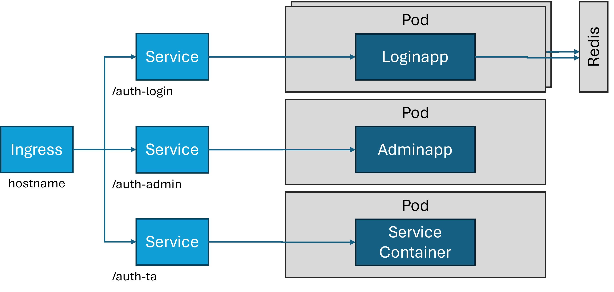

# 🚀 Welcome to the Airlock IAM Helm Chart - by Airlock Pre-Sales

*Airlock IAM is a comprehensive authentication and identity management solution for web applications and services that features a high degree of customization.*

<p align="left">
  
</p>

It can be installed either as a Self-Contained Application (SCA), directly on top of a Linux operating system. Or, as a container on a Docker host or in a Kubernetes cluster.

For the latter, a Helm chart is an easy option to generate and maintain the required manifests.

As of now, there is unfortunately no official chart. To simplify deploying Airlock IAM on Kubernets / OpenShift, the pre-sales team got to work. :-)

## Disclaimer

This is not an official chart. It is maintained by the Airlock Pre-Sales team, as time permits, on a best-efforts basis. Still, we welcome bug reports (issues) and PRs.

Also note, the chart is work in progress. Not all features and possible configurations have been tested and the structure of the configuration parameters may always change.

## Cluster requirements

The Kubernetes cluster must comply with the following requirements:

* At least one storage class available, potentially with support for ReadWriteMany
* One of the following ingress solutions must be installed and configured
  * Kubernetes Gateway API
  * Ingress
  * Project Contour HttpProxy

# Designing an Airlock IAM deployment

## Deployment layout

### Overview
Airlock IAM is a very powerful authentication engine, supporting many different use cases - [click for details](https://www.airlock.com/secure-access-hub/komponenten/iam). It consists of multiple web applications, uses a database, and can make use of Redis. Consequently, there are different ways to deploy it.

<p align="left">
  
</p>

Foremost, the web applications can either be kept together, as a single deployment, or they can all be managed as their individual (sandboxed) deployments. The advantage of the former option is its ease of use and administration. Upon activation, configuration changes are automatically distributed to all components which take it up immediately. On the other hand, it is impossible to individually scale independent web applications. Also, modules like the Service Container must not be running multiple times. Therefore, the combined deployment layout is geared towards test environments and proof-of-concepts and their replica count is fixed to 1.

<p align="left">
  
</p>

For a production environment, it is paramount to be able to freely scale the customer-facing loginapp and, potnetially also, transaction approval while, for example, there always must only be one replica of the service container.

By the way, using the new YAML config format, configuration environments, and GitOps, config changes can also be easily and automatically distributed across your whole setup, even with multiple deployments.

### Configuration

Use the following settings in <code>values.yaml</code> to define your deployment layout:

    iam:
      appDeploymentStrategy: single | multi
      apps:
        loginapp:
          enable: true | false
        adminapp:
          enable: true | false
        transactionApproval:
          enable: true | false
        ...

## Instance directory

### Storage considerations

Each Airlock IAM instance requires a so-called instance directory which contains:

* Application configuration
* UI resources
* Instance settings in <code>instance.properties</code>

All applications of the same instance must have access to the same content. How you achieve that is up to you but one obvious, simple way is to mount the same volume into all deployments. This requires a type of storage supporting ReadWriteMany or ReadOnlyMany, if you have chose appDeploymentStrategy 'multi'.

Unfortunately, logging may make the situation a bit more complicated. If you opt to have Airlock IAM ship to an Elasticsearch server, each replica will forcibly first write the logs to files before they are forwarded. By default, these files are also in the instance directory, leading to concurrent write access on text files.

To alleviate this challenge, the Helm chart forces an emptyDir() volume on the logs subdirectory and turns of local logging, if the number of replicas is greater than 1.

### <code>instance.properties</code>

For many settings in <code>instance.properties</code>, the Helm chart provides easy configuration possibilities, in <code>iam.apps.\<application-name\>.path</code> and <code>iam.instanceProperties[]</code>. There are also multiple sections to define environment variables which can be used to almost all other settings, e.g. in <code>iam.apps.\<application-name\>.dedicatedDeployment.env</code>, <code>iam.instanceProperties[].env</code>, and <code>env</code>. Finally, a few settings are pre-defined in the Helm chart and should not be overwritten:

* IAM_CONFIG_FORMAT
* IAM_HEALTH_PORT
* IAM_MODULES
* IAM_WEB_SERVER_HTTPS_PORT
* IAM_WEB_SERVER_HTTP_PORT

## Other important settings

* Hostname and TLS certificate in <code>ingress.dns.hostname</code> and <code>ingress.tls.secretName</code>, respectively.
* The required version of Airlock in <code>image.tag</code>
* If any application has more than one replica, it is strongly recommended to enable Redis in <code>redis.enable</code> and configure an <code>Expert Mode Redis State Repository</code> in Airlock IAM.
  * Due to limitations in the Helm dependency condition syntax, this can unfortunately not be automated.
  * For simplification, the Helm charts sets the following environment variable:
    * IAM_CFG_REDIS_EXPERT_CONFIG
  * In your <code>iam-config.yaml</code> make sure that the <stateRepository> config contains the following:
  ```
  yamlConfig:
    - value: "sentinelServersConfig: \n  connectTimeout: 10000 \n  masterName: \"mymaster\" \n  sentinelAddresses: \n  - \"redis://redis1:2812\" \n  - \"redis://redis2:2813\"  "
      var:
        name: IAM_CFG_REDIS_EXPERT_CONFIG

  ```

## Database setup

With the exception of a few specific use cases, Airlock IAM requires a SQL database. The Helm chart supports embedded provisioning of two different database engines, MariaDB and PostgreSQL. In addition, it can interface with exisiting, previously deployed database systems. In this case, MySQL, MS SQL and Oracle are also supported.

How Airlock IAM accesses this database is defined in the application configuration. By default, this configuraion is maintained with the built-in Config Editor. However, using environment variables, the Helm chart can provide the necessary configuration information form its database setup to Airlock IAM.

The Helm chart sets the following environment variables:

* IAM_CFG_DB_DRIVER_CLASS
* IAM_CFG_DB_URL
* IAM_CFG_DB_USERNAME
* IAM_CFG_DB_PASSWORD

To ensure Airlock IAM respects these variables, search for the key sqlDataSource in the configuration file <code>iam-config.yaml</code> and adapt according to the following:

    sqlDataSource:
      type: com.airlock.iam.core.misc.impl.persistency.db.JdbcConnectionPool
      displayName: Env-var-controlled Database Connection
      properties:
        driverClass:
        - value: org.mariadb.jdbc.Driver
          var:
            name: IAM_CFG_DB_DRIVER_CLASS
        password:
        - value: password
          var:
            name: IAM_CFG_DB_PASSWORD
            sensitive: true
        url:
        - value: jdbc:mariadb://localhost:3306/iam73
          var:
            name: IAM_CFG_DB_URL
        user:
        - value: airlock_iam
          var:
            name: IAM_CFG_DB_USERNAME

# Installing Airlock IAM

## Preparations

* Airlock IAM images are hosted on Quay.io but are not publicly accessible. Create the necessary pull secret using these [instructions](https://kubernetes.io/docs/tasks/configure-pod-container/pull-image-private-registry/).
* Create a ConfigMap or Secret with the license:
```
    kubectl create secret generic \<name\> --from-file=license.txt=\<filename\>
    kubectl create configmap \<name\> --from-file=license.txt=\<filename\>
```
* Create <code>custom.yaml</code> with your settings
```
    cp values.yaml custom.yaml
    vi custom.yaml
```

## Installation

Run Helm to create the Airlock IAM deployment:

```
    helm install airlock-iam . -f custom.yaml --namespace airlock-iam --create-namespace
```
